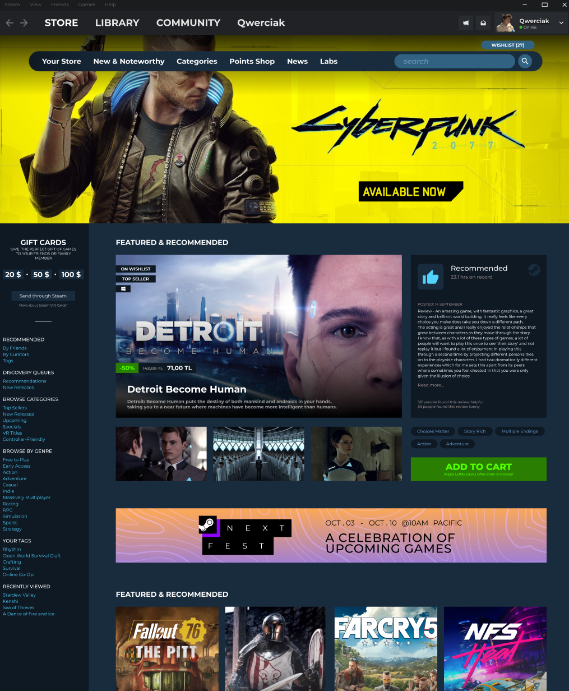

# Steam_Paste_deitroid_figma

Ten projekt jest wzorowany na dizajnie Steam z figmy. Jest to prosta i elegancka strona internetowa, która pozwala użytkownikom udostępniać i przeglądać swoje ulubione pasty na platformie Steam.

## Wzorowane Steam z figmy

Ten projekt został wzorowany na oryginalnym projekcie steam z figmy. Stworzyliśmy go z zamiarem dostarczenia użytkownikom past Steam jeszcze lepszych doświadczeń.

## Funkcje

- Brak

## Technologie

Ten projekt został zbudowany przy użyciu następujących technologii:

- HTML
- CSS

## Uruchamianie projektu

Aby uruchomić ten projekt lokalnie, wykonaj następujące kroki:

1. Sklonuj repozytorium na swoje urządzenie.
2. Uruchom projekt idex.html

## Wkład

Jeśli chcesz przyczynić się do rozwoju projektu, możesz to zrobić, przesyłając swoje propozycje poprawek i nowych funkcji jako Pull Requesty.

## Licencja

Ten projekt jest objęty licencją MIT. Więcej informacji znajduje się w pliku `LICENSE`.
